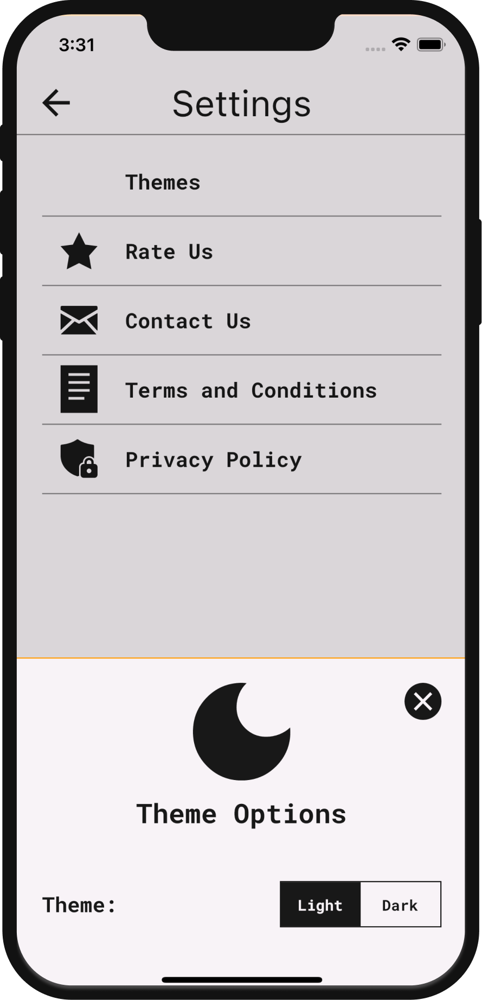

# 
Todo

An app that helps users create and save their daily tasks locally on their devices. The project has been written solely in `Dart` language.

&nbsp;

State Management: `flutter_bloc`

Dependency Injection: `get_it`

Database: `floor`

Simple Storage: `shared_preferences`

Router: `go_router`

Test: `mocktail`

&nbsp;

### Screenshots of the app:

&nbsp; &nbsp; &nbsp; &nbsp; &nbsp;

&nbsp;

&nbsp; &nbsp; &nbsp; &nbsp; &nbsp;

&nbsp;

&nbsp; &nbsp; &nbsp; &nbsp; &nbsp;

&nbsp;

&nbsp; &nbsp; &nbsp; &nbsp; &nbsp;

